# Personal Profile Page

• Web games prototypes; Learning parts of video game.

• Javascript modules; canvas overlay editor tool stats graphic.

• Mouse pointer and cursors; file format png gif cur ani.

# UNRELATED SECTION!

## Game test

Current broken website upload was for test of a game project.

[skyops117.github.io](https://skyops117.github.io/)


## Github logo SVG gradient code example


## Animated SVG

 

### Keyboard text art

```
  _____ _____ _____ _____ _____ _____ _____ _____ _____ _____ _____ _____ _____ _____________ 
 || # ||| 1 ||| 2 ||| 3 ||| 4 ||| 5 ||| 6 ||| 7 ||| 8 ||| 9 ||| 0 ||| - ||| = |||     ←     ||
 ||___|||___|||___|||___|||___|||___|||___|||___|||___|||___|||___|||___|||___|||___________||
 |/___\|/___\|/___\|/___\|/___\|/___\|/___\|/___\|/___\|/___\|/___\|/___\|/___\|/___________\|
  _______ _____ _____ _____ _____ _____ _____ _____ _____ _____ _____ _____ _____ ___________ 
 || tab ||| Q ||| W ||| E ||| R ||| T ||| Y ||| U ||| I ||| O ||| P ||| [ ||| ] |||    \    ||
 ||_____|||___|||___|||___|||___|||___|||___|||___|||___|||___|||___|||___|||___|||_________||
 |/_____\|/___\|/___\|/___\|/___\|/___\|/___\|/___\|/___\|/___\|/___\|/___\|/___\|/_________\|
  __________ _____ _____ _____ _____ _____ _____ _____ _____ _____ _____ _____ ______________ 
 ||  caps  ||| A ||| S ||| D ||| F ||| G ||| H ||| J ||| K ||| L ||| ; ||| ` |||    enter   ||
 ||________|||___|||___|||___|||___|||___|||___|||___|||___|||___|||___|||___|||____________||
 |/________\|/___\|/___\|/___\|/___\|/___\|/___\|/___\|/___\|/___\|/___\|/___\|/____________\|
  _____________ _____ _____ _____ _____ _____ _____ _____ _____ _____ _____ _________________ 
 ||   shift   ||| Z ||| X ||| C ||| V ||| B ||| N ||| M ||| ' ||| . ||| / |||     shift     ||
 ||___________|||___|||___|||___|||___|||___|||___|||___|||___|||___|||___|||_______________||
 |/___________\|/___\|/___\|/___\|/___\|/___\|/___\|/___\|/___\|/___\|/___\|/_______________\|
  ________ ______ _______ ____________________________________ _______ ______ ______ ________ 
 || ctrl ||| 🗔 ||| alt |||                ____              ||| alt ||| fn ||| 🖺 ||| ctrl ||
 ||______|||____|||_____|||__________________________________|||_____|||____|||____|||______||
 |/______\|/____\|/_____\|/__________________________________\|/_____\|/____\|/____\|/______\|
```
<!-- 
### My profile description as svg into the markdown as test.

-->

### Write custom text on the fly guide ♥

💻 Tested on Windows OS.",

📝 Inside a focused text input area showing text mouse cursor.

🎹 Hold "alt" key + tap on the numpad key number 3.

✅ Make sure numpad lock is on.

💖 Then let go of "alt" key to complete the code.

📜 Code are ASCII for using "alt" only and Unicode when using "alt" + "x"

 If "alt" + "x" doesn't output correctly, add "U+" before the code.

🧑‍💻Insert custom test like this and have fun!


### Drawing shapes with text

#### Lines

```
─━│┃┄┅┆┇┈┉┊┋┌┍┎┏
┐┑┒┓└┕┖┗┘┙┚┛├┝┞┟
┠┡┢┣┤┥┦┧┨┩┪┫┬┭┮┯
┰┱┲┳┴┵┶┷┸┹┺┻┼┽┾┿
╀╁╂╃╄╅╆╇╈╉╊╋╌╍╎╏
═║╒╓╔╕╖╗╘╙╚╛╜╝╞╟
╠╡╢╣╤╥╦╧╨╩╪╫╬╭╮╯
╰╱╲╳╴╵╶╷╸╹╺╻╼╽╾╿
```

#### Blocks

```
▓▒░
▔▀▁▂▃▄▅▆▇█▉▊▋▌▐▍▎▏▕
▗▖▝▘▙▚▛▜▞▟
```


